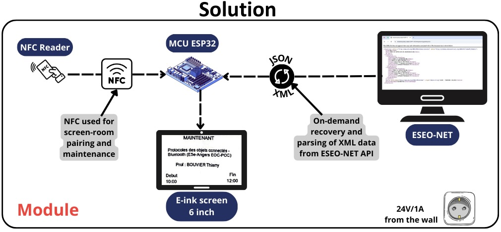

# Introduction et Contexte

## Objectif du projet
Le projet vise à créer un **module d’affichage pour salles et laboratoires à l’ESEO** qui soit :  
- **Facile à lire**, même en plein soleil.  
- **Sécurisé**, avec un accès réservé aux administrateurs pour la maintenance via un lecteur RFID.  
- **Peu coûteux**, avec un coût de production inférieur à 30 € par module.  
- **Évolutif et autonome**, capable de fournir des informations en temps réel.

Chaque module est conçu pour être installé devant une salle ou un laboratoire afin d’afficher instantanément l’emploi du temps et l’occupation de la salle. Le module intègre un **capteur RFID** pour permettre aux utilisateurs autorisés (personnel de maintenance) d’accéder à un mode administrateur et de sélectionner la salle afin de mettre à jour ou gérer l’affichage.

## Problématique
À l’ESEO, l’accès aux salles de classe et aux laboratoires se fait via les badges des étudiants et enseignants, et les emplois du temps sont disponibles uniquement en ligne. Il est donc **impossible de savoir instantanément si une salle est libre ou occupée depuis les couloirs**.  

**Problématique principale** :  
> Comment créer un module d’affichage facile à lire, sécurisé, peu coûteux et évolutif pour les salles, qui fournisse des informations autonomes en temps réel à tous les utilisateurs de l’ESEO ?

## Motivation et contexte
L’objectif est de rendre l’information sur l’occupation des salles **visible directement à côté de chaque porte** grâce à un écran connecté à ESEO-NET. Le projet s’inscrit dans une volonté de moderniser l’affichage des informations internes à l’école, tout en garantissant un coût faible, une consommation énergétique maîtrisée et une installation simple.

## Objectifs spécifiques
Dans l’ordre de priorité :  
1. Lisibilité optimale, même en plein soleil.  
2. Affichage en temps réel des informations.  
3. Faible coût de production (via un PCB optimisé).  
4. Utilisation améliorée pour les administrateurs et les utilisateurs.  
5. Sécurité renforcée : seul le personnel autorisé peut accéder au mode maintenance grâce à la carte RFID.

## Public cible
- **Utilisateurs finaux** : étudiants, enseignants et administration de l’ESEO.  
- **Installation et maintenance** : personnel de maintenance et administrateurs.

## Contraintes et améliorations par rapport à l’état de l’art
- **Coût** : < 30 € par module (lecteur NFC + ESP32 + boutons + écran).  
- **Affichage et mises à jour** : informations en temps réel avec mises à jour toutes les heures (XML → JSON).  
- **Consommation électrique** : conception à faible consommation d’énergie, courant de pointe < 100 mA sur 24 V.  
- **Sécurité** : accès réservé aux administrateurs via carte NFC.  
- **Installation** : facile à installer, retirer et remplacer.  

**Améliorations par rapport à la solution existante** :  
- Écran E-ink 6 pouces avec interface parallèle.  
- Réduction des coûts de 34 %.  
- Changements significatifs dans la mise en œuvre.  
- Convertisseur 24 V DC/DC amélioré.

# Matériel / Hardware

## Introduction
Le projet utilise plusieurs composants électroniques pour afficher les plannings des salles de l’ESEO et gérer le mode maintenance.  
**Remarque importante** : le nouvel écran 6 pouces (6ink) n'a pas encore été testé car nous n'avons pas le PCB associé. Les pins décrites ci-dessous concernent l'ancien écran e-paper 4.2 pouces.

## Composants

### 1. ESP32
- **Modèle** : Devkit  
- **Rôle** : Cerveau du projet, exécute le code et gère la communication avec tous les périphériques.

### 2. Écran e-paper actuel
- **Modèle** : 4.2 pouces e-paper module  
- **Protocole** : SPI  
- **Fonction** : Affichage du planning des salles et de la partie maintenance pour le choix de la salle.

### 3. Nouvel écran 6ink (non testé)
- **Modèle** : ED060SC4, écran Kindle 2  
- **Protocole prévu** : SPI  
- **Fonction prévue** : Affichage plus grand pour les plannings. Le driver est réalisé sur PCB séparé.  
- **Remarque** : Comme seule la dalle de l’écran est disponible, le driver pour l’ESP32 est développé séparément.

### 4. Capteur RFID / NFC
- **Modèle** : RC522  
- **Fonction** : Scanner les tags des administrateurs pour accéder au mode maintenance et sélectionner la salle.

### 5. Boutons
- **2 boutons Haut / Bas** : Permettent de scroller pour le choix du bâtiment, étage et salle.  
- **2 boutons Retour / Valider** : Pour confirmer ou revenir en arrière dans le menu.

---

## Tableau récapitulatif pour l'écran E-Paper 4.2inch

| Interface | Pin ESP32 |SPI E-paper| Pin E-Paper   |
|-----------|-----------|-----------|---------------|
| HSPI      | CLK 14    | CLK (SCLK)| 14            |
| HSPI      | MISO 12   | -         | -             |
| HSPI      | MOSI 13   | DIN (MOSI)| 13            |
| HSPI      | CS 15     | CS        | 15            |
|           |           | DC        | 32            |
|           |           | BST (RST) | 27            |
|           |           | BUSY      | 33            |

## Tableau récapitulatif pour le capteur NFC RC522

| Interface | Pin ESP32 | SPI RC522 reader| Pin RC522 reader |
|-----------|-----------|-----------------|------------------|
| VSPI      | CLK 18    | SCK (SCLK/CLK)  | 18               |
| VSPI      | MISO 19   | MISO            | 19               |
| VSPI      | MOSI 23   | MOSI            | 23               |
| VSPI      | CS 5      | SDA (CS)        | 5                |
|           |           | RST             | 4                |

## Tableau récapitulatif pour les boutons 

| Bouton   | Pin ESP32 |
|----------|-----------|
| UP       | 26        |
| DOWN     | 25        |
| BACK     | 16        |
| SELECT   | 17        |

## Schéma de connexion

  

## Software et Architecture

Le code du projet est organisé de manière modulaire pour faciliter la maintenance et la compréhension.  
Le dossier principal `main` contient le fichier `main.cpp`, qui lance l’ensemble du projet grâce à la fonction `app_main`.  

Autour de ce fichier, plusieurs sous-dossiers ont été créés pour séparer les différentes fonctionnalités : `accents`, `button`, `data`, `display`, `menu`, `planning`, `rc522` et `wifi`.  

Le schéma global permet à chaque module d’interagir avec `main.cpp`, qui orchestre le fonctionnement du système.

# Vue d'ensemble des sous-dossiers du projet

| Sous-dossier | Description / Contenu |
|--------------|----------------------|
| accents      | Contient la fonction `removeAccents` qui supprime les accents d’une chaîne de caractères UTF-8, utile pour normaliser les noms de salles ou bâtiments avant affichage. |
| button       | Contient la gestion des boutons pour naviguer dans les menus (Haut, Bas, Sélection, Retour). Les handlers principaux sont `handle_up_press`, `handle_down_press`, `handle_select_press` et `handle_back_press`. Le fichier gère aussi la tâche `buttons_task` qui lit les boutons avec anti-rebond et mutex pour éviter les conflits. |
| data         | Contient les informations sur toutes les salles de l’ESEO (`salles.h`) avec leurs identifiants et noms. Fournit des fonctions utilitaires comme `getBatiment`, `getEtage`, `nombreDeSalles`, `getSalleIndex` et `clampIndex` pour récupérer les informations d’une salle selon le bâtiment, l’étage ou l’index. |
| display      | Gère tout l’affichage sur l’écran e-paper (menus, sélection de bâtiment/étage/salle, mode maintenance, messages). Contient des fonctions comme `displayClearAndTextCentered`, `displayMaintenanceMode`, `displayMenuBuildings`, `displayMenuEtages` et `displaySalleList` pour dessiner le contenu à l’écran. |
| menu         | Gère la logique du menu et le traitement des événements RFID. Contient la tâche `menu_task` qui active le menu lorsqu’un tag autorisé est scanné et le handler `rc522_handler` qui signale l’événement RFID. |
| planning     | Gère la récupération et l’affichage des plannings des salles. Contient la fonction `getPlanningFromServer` pour récupérer les données via HTTP, `parsePlanning` pour parser le JSON, `displayPlanning` pour afficher les cours sur l’écran, et la tâche `planning_task` qui met à jour périodiquement l’affichage. |
| rc522        | Gestion du lecteur RFID MFRC522. Fournit l’interface pour initialiser (`rc522_create`), démarrer (`rc522_start`) et arrêter (`rc522_pause`) le scan de tags, lire les cartes (`rc522_get_tag`), calculer le CRC et dispatcher les événements de tag scanné (`rc522_dispatch_event`). Le code supporte SPI et I2C et utilise une tâche FreeRTOS pour le scan continu des tags. |
| wifi         | Gestion de la connexion Wi-Fi en mode station. Initialise le périphérique réseau, configure le SSID/mot de passe (`WIFI_SSID` / `WIFI_PASS`) et tente de se connecter. Utilise la boucle FreeRTOS pour attendre la connexion avec logs ESP. Fonction principale : `wifi_init_sta()`. |

