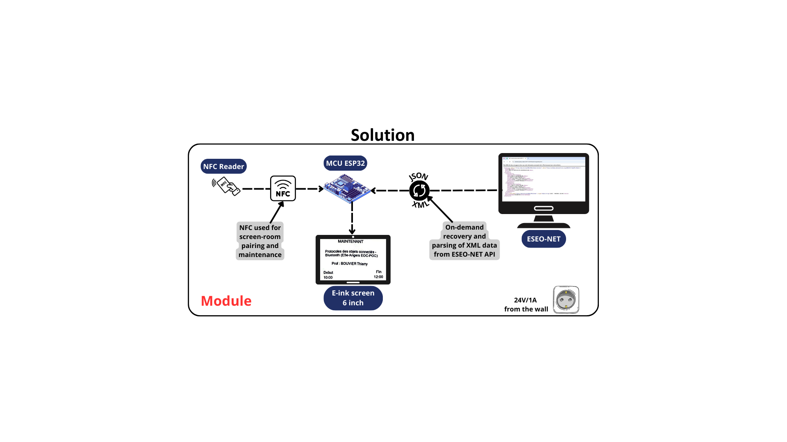

# Introduction et Contexte

## Objectif du projet
Le projet vise à créer un **module d’affichage pour salles et laboratoires à l’ESEO** qui soit :  
- **Facile à lire**, même en plein soleil.  
- **Sécurisé**, avec un accès réservé aux administrateurs pour la maintenance via un lecteur RFID.  
- **Peu coûteux**, avec un coût de production inférieur à 30 € par module.  
- **Évolutif et autonome**, capable de fournir des informations en temps réel.

Chaque module est conçu pour être installé devant une salle ou un laboratoire afin d’afficher instantanément l’emploi du temps et l’occupation de la salle. Le module intègre un **capteur RFID** pour permettre aux utilisateurs autorisés (personnel de maintenance) d’accéder à un mode administrateur et de sélectionner la salle afin de mettre à jour ou gérer l’affichage.

## Problématique
À l’ESEO, l’accès aux salles de classe et aux laboratoires se fait via les badges des étudiants et enseignants, et les emplois du temps sont disponibles uniquement en ligne. Il est donc **impossible de savoir instantanément si une salle est libre ou occupée depuis les couloirs**.  

**Problématique principale** :  
> Comment créer un module d’affichage facile à lire, sécurisé, peu coûteux et évolutif pour les salles, qui fournisse des informations autonomes en temps réel à tous les utilisateurs de l’ESEO ?

## Motivation et contexte
L’objectif est de rendre l’information sur l’occupation des salles **visible directement à côté de chaque porte** grâce à un écran connecté à ESEO-NET. Le projet s’inscrit dans une volonté de moderniser l’affichage des informations internes à l’école, tout en garantissant un coût faible, une consommation énergétique maîtrisée et une installation simple.

## Objectifs spécifiques
Dans l’ordre de priorité :  
1. Lisibilité optimale, même en plein soleil.  
2. Affichage en temps réel des informations.  
3. Faible coût de production (via un PCB optimisé).  
4. Utilisation améliorée pour les administrateurs et les utilisateurs.  
5. Sécurité renforcée : seul le personnel autorisé peut accéder au mode maintenance grâce à la carte RFID.

## Public cible
- **Utilisateurs finaux** : étudiants, enseignants et administration de l’ESEO.  
- **Installation et maintenance** : personnel de maintenance et administrateurs.

## Contraintes et améliorations par rapport à l’état de l’art
- **Coût** : < 30 € par module (lecteur NFC + ESP32 + boutons + écran).  
- **Affichage et mises à jour** : informations en temps réel avec mises à jour toutes les heures (XML → JSON).  
- **Consommation électrique** : conception à faible consommation d’énergie, courant de pointe < 100 mA sur 24 V.  
- **Sécurité** : accès réservé aux administrateurs via carte NFC.  
- **Installation** : facile à installer, retirer et remplacer.  

**Améliorations par rapport à la solution existante** :  
- Écran E-ink 6 pouces avec interface parallèle.  
- Réduction des coûts de 34 %.  
- Changements significatifs dans la mise en œuvre.  
- Convertisseur 24 V DC/DC amélioré.

# Matériel / Hardware

## Introduction
Le projet utilise plusieurs composants électroniques pour afficher les plannings des salles de l’ESEO et gérer le mode maintenance.  
**Remarque importante** : le nouvel écran 6 pouces (6ink) n'a pas encore été testé car nous n'avons pas le PCB associé. Les pins décrites ci-dessous concernent l'ancien écran e-paper 4.2 pouces.

## Composants

### 1. ESP32
- **Modèle** : Devkit  
- **Rôle** : Cerveau du projet, exécute le code et gère la communication avec tous les périphériques.

### 2. Écran e-paper actuel
- **Modèle** : 4.2 pouces e-paper module  
- **Protocole** : SPI  
- **Fonction** : Affichage du planning des salles et de la partie maintenance pour le choix de la salle.

### 3. Nouvel écran 6ink (non testé)
- **Modèle** : ED060SC4, écran Kindle 2  
- **Protocole prévu** : SPI  
- **Fonction prévue** : Affichage plus grand pour les plannings. Le driver est réalisé sur PCB séparé.  
- **Remarque** : Comme seule la dalle de l’écran est disponible, le driver pour l’ESP32 est développé séparément.

### 4. Capteur RFID / NFC
- **Modèle** : RC522  
- **Fonction** : Scanner les tags des administrateurs pour accéder au mode maintenance et sélectionner la salle.

### 5. Boutons
- **2 boutons Haut / Bas** : Permettent de scroller pour le choix du bâtiment, étage et salle.  
- **2 boutons Retour / Valider** : Pour confirmer ou revenir en arrière dans le menu.

---

## Tableau récapitulatif pour l'écran E-Paper 4.2inch

| Interface | Pin ESP32 |SPI E-paper| Pin E-Paper   |
|-----------|-----------|-----------|---------------|
| HSPI      | CLK 14    | CLK (SCLK)| 14            |
| HSPI      | MISO 12   | -         | -             |
| HSPI      | MOSI 13   | DIN (MOSI)| 13            |
| HSPI      | CS 15     | CS        | 15            |
|           |           | DC        | 32            |
|           |           | BST (RST) | 27            |
|           |           | BUSY      | 33            |

## Tableau récapitulatif pour le capteur NFC RC522

| Interface | Pin ESP32 | SPI RC522 reader| Pin RC522 reader |
|-----------|-----------|-----------------|------------------|
| VSPI      | CLK 18    | SCK (SCLK/CLK)  | 18               |
| VSPI      | MISO 19   | MISO            | 19               |
| VSPI      | MOSI 23   | MOSI            | 23               |
| VSPI      | CS 5      | SDA (CS)        | 5                |
|           |           | RST             | 4                |

## Tableau récapitulatif pour les boutons 

| Bouton   | Pin ESP32 |
|----------|-----------|
| UP       | 26        |
| DOWN     | 25        |
| BACK     | 16        |
| SELECT   | 17        |

## Schéma de connexion

  

